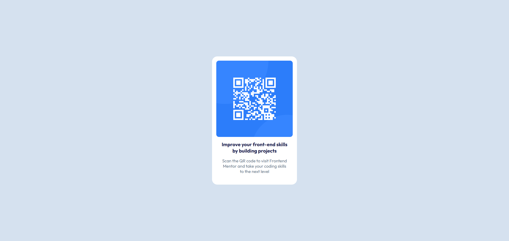

# Frontend Mentor - QR code component solution

This is a solution to the [QR code component challenge on Frontend Mentor](https://www.frontendmentor.io/challenges/qr-code-component-iux_sIO_H). Frontend Mentor challenges help you improve your coding skills by building realistic projects.

## Table of contents

- [Frontend Mentor - QR code component solution](#frontend-mentor---qr-code-component-solution)
  - [Table of contents](#table-of-contents)
  - [Overview](#overview)
    - [Screenshot](#screenshot)
    - [Links](#links)
  - [My process](#my-process)
    - [Built with](#built-with)
    - [What I learned](#what-i-learned)
  - [Author](#author)

## Overview

### Screenshot



### Links

- Solution URL: [Add solution URL here](https://github.com/Creative-mindset21/Frontend-Mentor-Projects/tree/main/QR%20Code%20Component)
- Live Site URL: [Add live site URL here](https://qr-code-component-rust-nine.vercel.app/)

## My process

### Built with

- Semantic HTML5 markup
- CSS custom properties
- Flexbox

### What I learned

```html
<main>The use of semantic tags like main instead of using div</main>
```

```css
.proud-of-this-css {
  display: flex;
}
```

## Author

- Website - [Creative Mindset](https://github.com/Creative-mindset21)
- Frontend Mentor - [@Creative-mindset21](https://www.frontendmentor.io/profile/Creative-mindset21)
